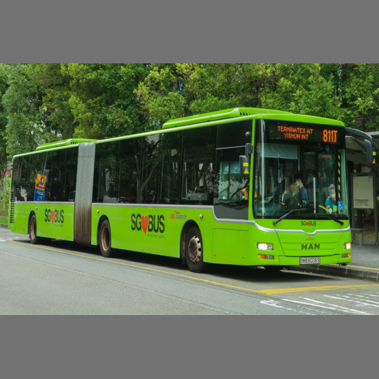
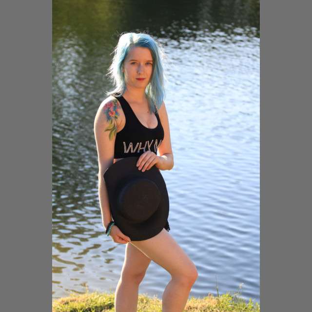

# YOLOv8 Object Detection


## Requirements

* export YOLOv8 model into torchscript, see [models/yolo.sh](models/yolo.sh) or take a look at quick start section  _Obtain YOLOv8_
* download libtorch, see https://pytorch.org/

The following library is tested against stable version `libtorch-2.4.0`. 

## Quick Start

### Install opencv

In case you want to use opencv, please install it first:

```bash
apt install libopencv-dev clang libclang-dev
```


### Obtain YOLOv8

```bash
virtualenv ultra
. ultra/bin/activate
pip3 install ultralytics
yolo export model=yolov8n.pt
ls -l yolov8n.torchscript
```

More on yolo export: https://docs.ultralytics.com/modes/export/#__tabbed_1_2


### Get `libtorch`

Get `libtorch` from https://pytorch.org/, the current bindings are using stable version of `2.4.0`. Please decide beforehand if you want to use `cpu` or `cuda` version.
```bash
unzip ~/Downloads/libtorch-cxx11-abi-shared-with-deps-2.4.0+cpu.zip
```

### Build

```bash
source ./env # environment
cargo build --release
```

### Build Examples

The video example needs to have opencv installed and enabled as feature.

```bash
source ./env # environment
cargo build --release --examples --features=opencv
```

### Run Examples

```bash
source ./env # environment
target/release/examples/yolo-predict
```

```bash
source ./env # environment
target/release/examples/video <some.video.file>
```

## Description

This library tries to do things as close as `ultralytics` python package.

### Image pre-processing

Two options are available: using torch and tensor, or using `opencv`. In the latter case the `opencv` feature must be turned on (default is off).

We pad the image exactly as `ultralytics` does, i.e. the aspect ratio is preserved and the gray (114, 114, 114) coler
is used as padding to keep `(640, 640)` as input dimension.





### Image post-processing

We try to use `torch` and _tensors_ as long as possible. However, in certain cases it might be faster to move the prediction to the `cpu`. In that case, please initialize yolo as:

```rust
let yolo = yolo_v8::YoloV8ObjectDetection::with_model(yolo_v8::YOLOModel::Nano).post_process_on_cpu();
```