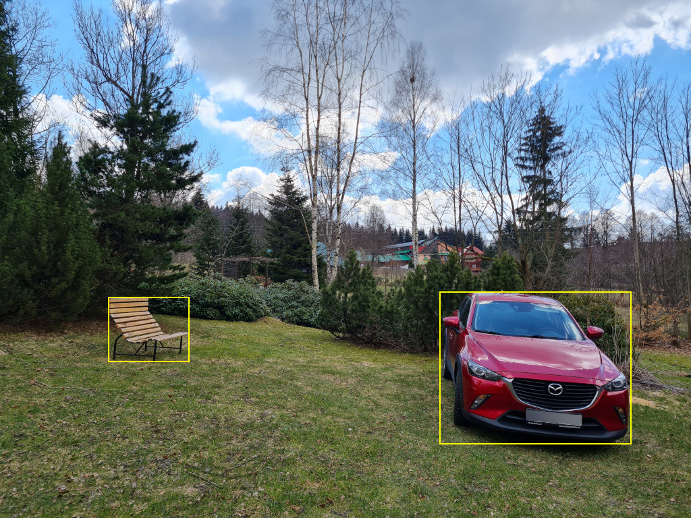

# YOLOv8 Object Detection




## Requirements

* export YOLOv8 model into torchscript, see [models/yolo.sh](models/yolo.sh) or take a look at quick start section  _Obtain YOLOv8_
* download libtorch, see https://pytorch.org/

The following library is tested against stable version `libtorch-2.4.0`. 

## Quick Start

### Obtain YOLOv8

```bash
virtualenv ultra
. ultra/bin/activate
pip3 install ultralytics
yolo export model=yolov8n.pt
ls -l yolov8n.torchscript
```

More on yolo export: https://docs.ultralytics.com/modes/export/#__tabbed_1_2


### Build

Get `libtorch` from https://pytorch.org/, the current bindings are using stable version of `2.4.0`:
```bash
unzip ~/Downloads/libtorch-cxx11-abi-shared-with-deps-2.4.0+cpu.zip
export LIBTORCH=$(pwd)/libtorch/
export LIBTORCH_INCLUDE=$(pwd)/libtorch/
export LIBTORCH_LIB=$(pwd)/libtorch/
cargo build --release
```

### Run
```bash
export LD_LIBRARY_PATH="$(pwd)/libtorch/lib/:$LD_LIBRARY_PATH"
target/release/neural
```